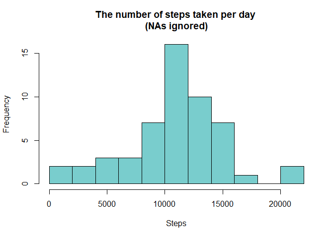
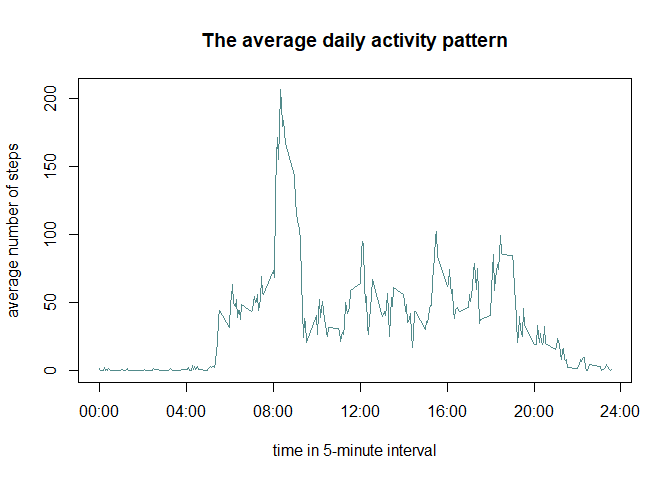
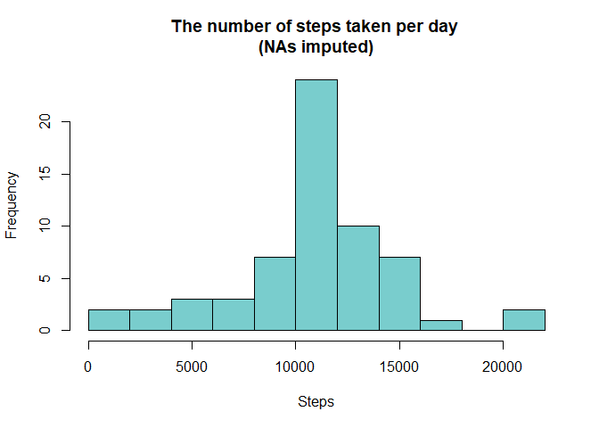
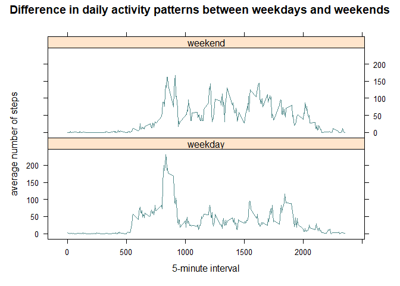

## Loading and preprocessing the data

The GitHub repository contains the dataset (activity.zip) for the assignment.

Unzip and read data:


```r
activity_data <- read.csv(unz("activity.zip", "activity.csv"))
str(activity_data)
```

```
## 'data.frame':	17568 obs. of  3 variables:
##  $ steps   : int  NA NA NA NA NA NA NA NA NA NA ...
##  $ date    : chr  "2012-10-01" "2012-10-01" "2012-10-01" "2012-10-01" ...
##  $ interval: int  0 5 10 15 20 25 30 35 40 45 ...
```

We can see that the object activity_data is a data frame with three variables:  
- steps: Number of steps taken in a 5-minute interval (missing values are coded as NA)  
- date: The date on which the measurement was taken in YYYY-MM-DD format  
- interval: Identifier for the 5-minute interval in which measurement was taken  

There are 17586 observations.

The class of the date variable seems to be character instead of date. We can fix this right away by calling as.Date function. Also steps and interval variables are changed from integer to numeric (this will become handy when imputing missing values).


```r
activity_data$date <- as.Date(activity_data$date)
class(activity_data$date)
```

```
## [1] "Date"
```

```r
activity_data$steps <- as.numeric(activity_data$steps)
class(activity_data$steps)
```

```
## [1] "numeric"
```

```r
activity_data$interval <- as.numeric(activity_data$interval)
class(activity_data$interval)
```

```
## [1] "numeric"
```

Load needed packages:


```r
# If it isn’t installed, install the data.table and/or lattice package(s) with install.packages()
library(data.table)
library(lattice)
```

## What is mean total number of steps taken per day?

Calculate the total number of steps taken per day and report the mean and median:


```r
daily_steps <- aggregate(steps ~ date, activity_data, sum)
summary(daily_steps$steps)
```

```
##    Min. 1st Qu.  Median    Mean 3rd Qu.    Max. 
##      41    8841   10765   10766   13294   21194
```

Mean and median only differ with one step taken per day: mean is 10766 steps, whereas median is 10765 steps.
Note that missing values in the dataset are ignored.

Make a histogram of the total number of steps taken each day:


```r
hist(daily_steps$steps, breaks = 8, main = "The number of steps taken per day \n(NAs ignored)", xlab = "Steps", col = "darkslategray3")
```

<!-- -->

## What is the average daily activity pattern?

Make a time series plot of the 5-minute interval and the average number of steps taken, averaged across all days:


```r
pattern <- aggregate(steps ~ interval, activity_data, mean)

plot(pattern$interval, pattern$steps, type = "l", main = "The average daily activity pattern", xlab = "time in 5-minute interval", ylab = "average number of steps", col = "darkslategray4", xaxt = "n")
axis(1, at = c(0, 400, 800, 1200, 1600, 2000, 2400), labels = c("00:00", "04:00", "08:00", "12:00", "16:00", "20:00", "24:00"))
```

<!-- -->


X-axis labels were changes from numeric identifier for the 5-minute interval to format "HH:MM" so that the plot would be easier to read. There is a clear peak in activity a bit after 8 am and smaller peaks at around noon and between 3:30 pm and 7:30 pm. 

To be precise, let's calculate which 5-minute interval, on average across all the days in the dataset, contains the maximum number of steps:


```r
pattern$interval[which.max(pattern$steps)]
```

```
## [1] 835
```

Answer: 835 meaning 8:35 am.

## Imputing missing values

There are missing values in the steps variable (coded as NA). The presence of missing days may introduce bias into some calculations or summaries of the data.

Calculate and report the total number of missing values in the dataset:


```r
sum(is.na(activity_data))
```

```
## [1] 2304
```

```r
mean(is.na(activity_data))
```

```
## [1] 0.04371585
```

Answer: the total number of rows with NAs is 2304, which represents approximately 4 % of the rows.

The chosen strategy for filling in all of the missing values is to use mean for that 5-minute interval where the NA occurs.Note: The strategy does not need to be sophisticated.

Create a new dataset that is equal to the original dataset but with the missing data filled in using data.table package:


```r
complete_data <- activity_data

setDT(complete_data)
complete_data[, steps := ifelse(is.na(steps), mean(steps, na.rm = TRUE), steps), by = interval]
```

Calculate the total number of steps taken per day and report the mean and median for the second time:


```r
complete_daily_steps <- aggregate(steps ~ date, complete_data, sum)
summary(complete_daily_steps$steps)
```

```
##    Min. 1st Qu.  Median    Mean 3rd Qu.    Max. 
##      41    9819   10766   10766   12811   21194
```

Mean and median are now both 10766 steps. The impact of imputing missing data on the estimated of the total daily number of steps seems rather minimal since mean has not even changes and median only increased with one step.

Make a histogram of the total number of steps taken each day (this time NAs are not ignored but replaced with the mean for that 5-minute interval):


```r
hist(complete_daily_steps$steps, breaks = 8, main = "The number of steps taken per day \n(NAs imputed)", xlab = "Steps", col = "darkslategray3")
```

<!-- -->

We can see that the shape (= distribution) of the histogram is similar than previously. However frequencies have increased since there are now more observations in total (data from 61 days instead of 53 days when NAs were ignored).

## Are there differences in activity patterns between weekdays and weekends?

Create a new factor variable in the dataset with two levels – “weekday” and “weekend” indicating whether a given date is a weekday or weekend day:


```r
complete_data$day <- weekdays(complete_data$date)
complete_data$day <- gsub("Monday|Tuesday|Wednesday|Thursday|Friday", "weekday", complete_data$day)
complete_data$day <- gsub("Saturday|Sunday", "weekend", complete_data$day)
complete_data$day <- as.factor(complete_data$day)

str(complete_data$day)
```

```
##  Factor w/ 2 levels "weekday","weekend": 1 1 1 1 1 1 1 1 1 1 ...
```

Make a panel plot containing a time series plot of the 5-minute interval and the average number of steps taken, averaged across all weekday days or weekend days using lattice package:


```r
day_type <- aggregate(steps ~ interval + day, data = complete_data, mean)

xyplot(steps ~ interval | day, day_type, type = "l", layout = c(1, 2), main = "Difference in daily activity patterns between weekdays and weekends", xlab = "5-minute interval", ylab = "average number of steps", col.line = "darkslategray4")
```

<!-- -->

Time series plots reveal that there is a visible difference in the daily activity patterns depending on the day of the week. During weekdays there is a significant peak around 8:30 am whereas during weekends there are multiple smaller peaks.
